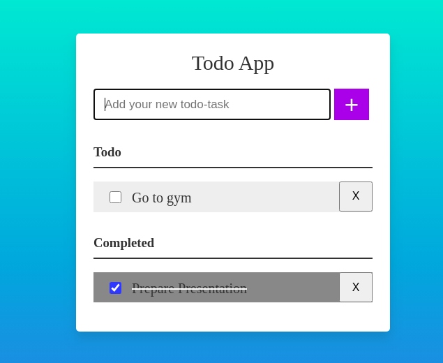

# Javascript-session

***This To-do app is created based on the knowledge gained from the javascript-session conducted on 20th January (Red Hat Developer Intern Training Sessions).
This app is created for the assessment purposes, that is to test the knowledge of the attendees.***

This To-do app is built using CSS, HTML and Javascript.

To-do app can:
1. Add tasks
2. Mark tasks as done
3. Delete tasks

**To-do App:**

